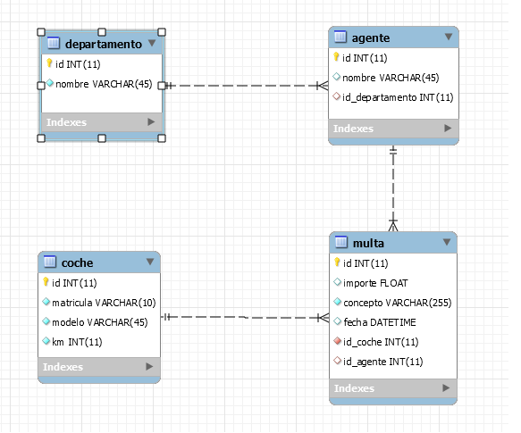

=========================
MULTAS
=========================

APP web para registrar infracciones de tráfico.

TECNOLOGIAS
----------------
JAVAEE, MySQL, proyecto mavenizado 3.0 
Uso de JSLT expression language.

Apendice Base de Datos
***************************

DIAGRAMA ENTIDAD-RELACION
----------------

    
UX
----------------

En la pagina principal podemos seleccionar entre dos opciones, "Ver Multas" o "Multar":

Al seleccionar "Ver Multas" nos llevara a un listado con las multas que tiene almacenadas
en la base de datos ese agente.

Al seleccionar "Multar" nos llevara a un formulario para buscar matriculas de coche, si
la matricula existe en la base de datos nos mandara a otro formulario para poder registrarle
una nueva multa. Sino existe la matricula te dira que no se encuentra en la base de datos y
que pruebes con otra diferente.

