=========================
MULTAS
=========================

APP web para registrar infracciones de tráfico.

TECNOLOGIAS
----------------
JAVAEE, MySQL, proyecto mavenizado 3.0 
Uso de JSLT expression language.
Html,Css,Js,Jquery

Apendice Base de Datos
***************************

DIAGRAMA ENTIDAD-RELACION
----------------

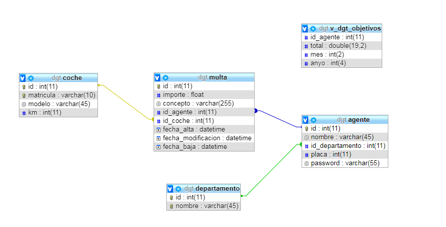

    
UX
----------------
Para empezar, debemos logearnos con el numero de placa y contraseña del agente:

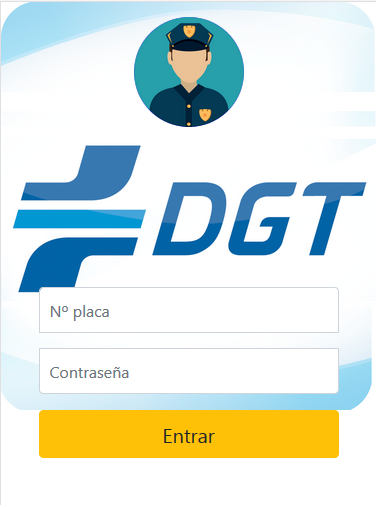

En la pagina principal podemos seleccionar entre cuatro opciones, "Ver Multas", "Multar", "Multas anuladas" y "Ver estadisticas":

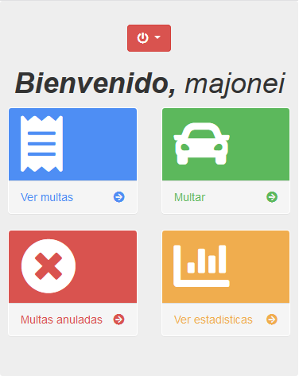

Al seleccionar "Ver Multas" nos llevara a un listado con las multas que tiene almacenadas
en la base de datos ese agente.

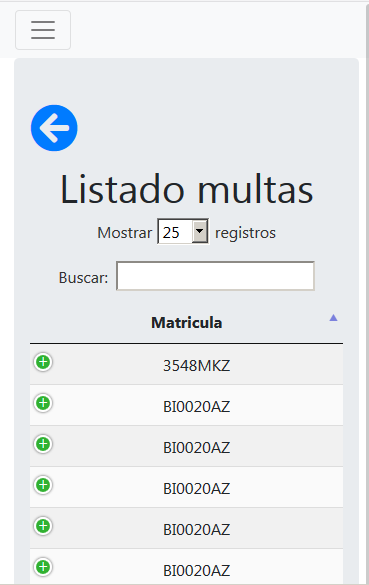

Tambien se puede filtrar por matricula, aunque se ordena automaticamente por fecha descendente
Al pinchar en el "+" nos despliega el detalle de dicha multa, asi como la opción de anularla

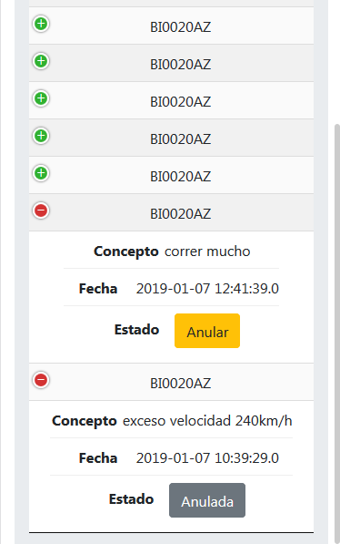

Para volver al menu tenemos 2 opciones, o con la flecha azul de atrás o desplegando el menu oculto en el que también podemos cerrar la sesión

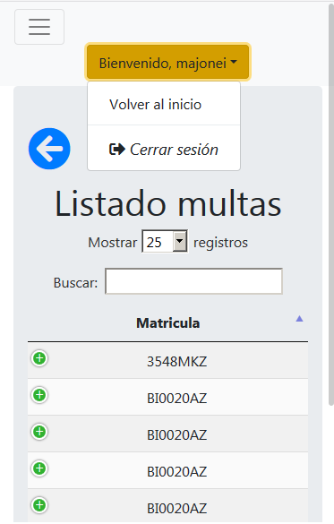

Vamos a ver las multas anulada de dicho agente, y como se pueden volver a habilitar en caso de que fuera un error

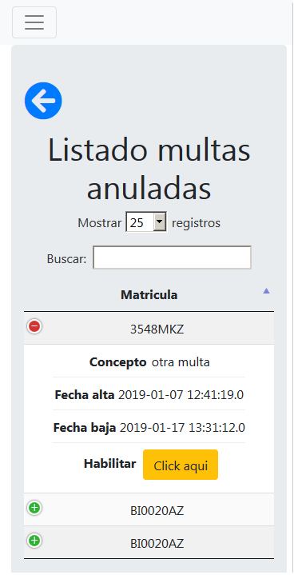

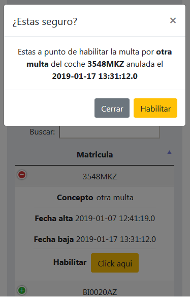
Al seleccionar "Multar" nos llevara a un formulario para buscar matriculas de coche, si
la matricula existe en la base de datos nos mandara a otro formulario para poder registrarle
una nueva multa. Sino existe la matricula te dira que no se encuentra en la base de datos y
que pruebes con otra diferente.

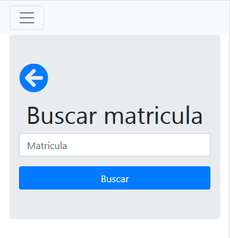

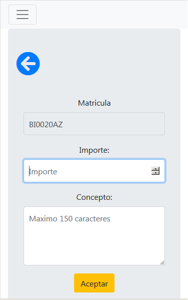

Y por ultimo tenemos los objetivos del agente, donde puede ver un detalle del año y de años anteriores de sus objetivos

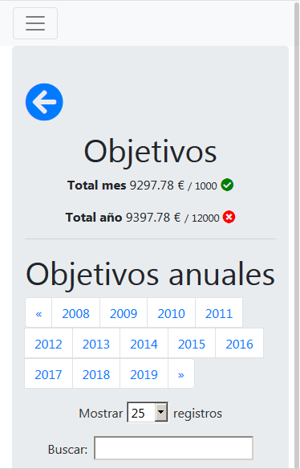

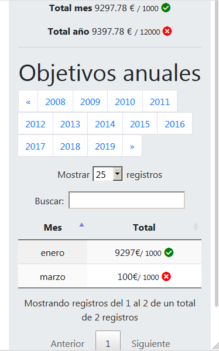

Control de errores:

Si se intenta acceder a una pagina que no existe se muestra la siguiente portada

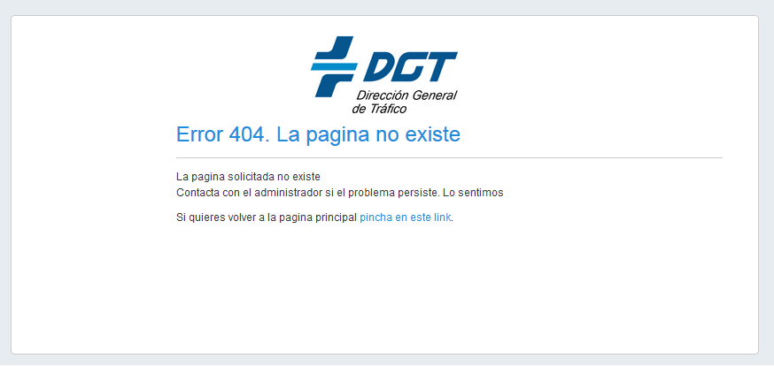

Y en caso de un error inesperado por parte de la aplicación o de intentar corromper el funcionamiento normal de programa por voluntad propia, muestra el siguiente error

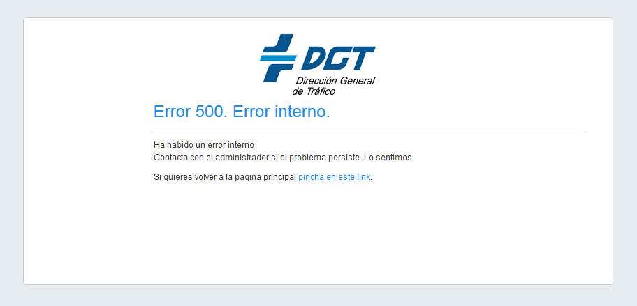

